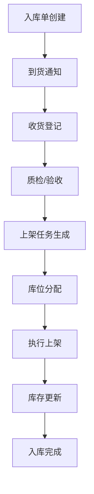
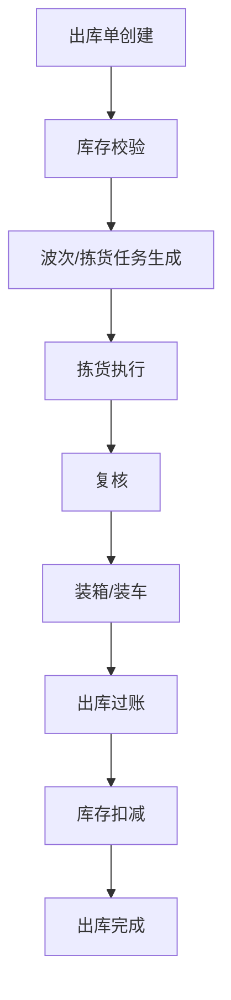
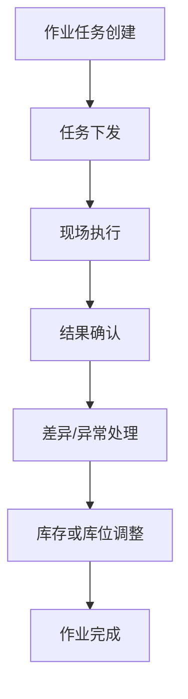

# 仓储流程设计图

本目录用于整理仓储业务中的流程设计图，聚焦三个核心场景：入库、出库、库内作业。
文档以流程梳理和节点说明为主，便于后续继续补充页面原型、状态流转、异常处理和角色分工。

## 目录结构

```text
bip-design/
├─ README.md
├─ 入库/
│  └─ README.md
├─ 出库/
│  └─ README.md
└─ 库内作业/
   └─ README.md
```

## 1. 入库流程设计图

适用场景：采购到货、生产入库、退货入库、调拨入库等。



### 关键节点

- 入库单创建：来源可以是采购单、生产单、调拨单或退货单。
- 收货登记：记录实到数量、批次、包装、托盘等信息。
- 质检/验收：判断是否合格，异常场景进入待处理流程。
- 上架任务生成：根据仓区策略生成上架指令。
- 库存更新：完成上架后更新可用库存和库位库存。

## 2. 出库流程设计图

适用场景：销售出库、生产领料、调拨出库、退供出库等。



### 关键节点

- 出库单创建：来源可以是销售订单、领料单、调拨单等。
- 库存校验：校验可用库存、批次、效期和锁定状态。
- 拣货执行：按照库位、波次或任务维度执行拣选。
- 复核：确认货品、数量、批次一致，减少错发漏发。
- 出库过账：完成业务单据状态变更并扣减库存。

## 3. 库内作业流程设计图

适用场景：移库、补货、盘点、冻结解冻、库位整理等。



### 关键节点

- 作业任务创建：可由系统策略自动生成，也可人工发起。
- 现场执行：作业人员按任务完成移库、补货、盘点等动作。
- 结果确认：记录实际数量、来源库位、目标库位等信息。
- 差异处理：针对盘亏盘盈、任务失败、库位异常等情况处理。
- 库存或库位调整：确保账实一致，沉淀最终作业结果。

## 4. 后续可补充内容

- 各流程的角色分工：仓管员、质检员、复核员、管理员
- 单据状态流转图
- 异常分支流程：拒收、短收、错发、盘点差异
- 页面原型与字段设计
- 与 ERP、WMS、PDA 的系统交互关系
